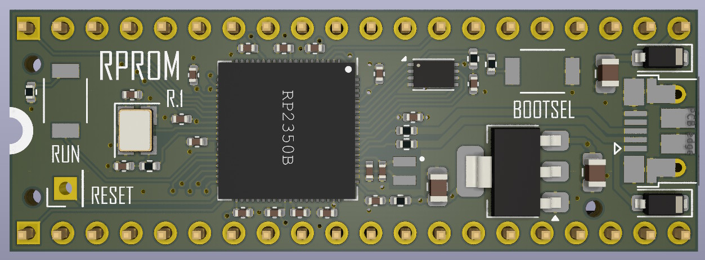

# RPROM

RPROM is a ROM emulator for 16 bit Amiga computers (A500, A600, A2000) based on
the RP2350B microcontroller. RPROM was designed in collaboration by
[Niklas Ekström](https://github.com/niklasekstrom/) and
[Per Bengtsson](https://github.com/RetroNynjah).

The RPROM board has a 4 MB SPI flash memory. Each ROM image is 512 kB in size,
and therefore the 4 MB is divided into eight *slots* of 512 kB each. The first
slot is dedicated to store code and configuration data for the RP2350B. The
seven remaining slots are used to store ROM images.

ROM images can be written to flash memory either via USB, or directly from the
Amiga using a program called `RPROM`. This `RPROM` program is also used to
switch which slot is the *active slot*.

This repository contains the [hardware](Hardware), [firmware](Firmware) and
[software](Software) for RPROM. The design is intended to be easily
understandable and hackable. For example, the firmware is built from a single,
roughly 300 lines long, [source code file](Firmware/rprom.c).

## The RPROM command

`RPROM` is a CLI command that runs on the Amiga. It has the following
subcommands:

- `RPROM status` prints status information about the device
- `RPROM switch <slot>` switches the active slot and reboots the Amiga
- `RPROM write <slot> <image>` writes the content of file `<image>` to
slot `<slot>`
- `RPROM read <slot> <image>` reads the content of slot `<slot>` and saves it
to file `<image>`
- `RPROM erase <slot>` erases slot `<slot>`

Note that ROM images should *not* be byte swapped.

## Programming using USB

Both the firmware and ROM images can be programmed from a PC using USB.
Programming is done using the `picotool` program, which can be downloaded from
https://github.com/raspberrypi/pico-sdk-tools/releases. The RP2350B
microcontroller needs to first be in download mode. To put the RP2350B in
download mode, hold down the BOOTSEL button on the board, and then click the
RUN button. The microcontroller should show up as a USB drive on your PC.

To program the firmware, run `picotool load rprom.uf2`.

To write a ROM image to a slot, run `picotool load <image> -t bin -o <addr>`,
where `<addr>` depends on the slot:

- slot 1: `0x10080000`
- slot 2: `0x10100000`
- slot 3: `0x10180000`
- slot 4: `0x10200000`
- slot 5: `0x10280000`
- slot 6: `0x10300000`
- slot 7: `0x10380000`

## License

This design is free for non-comercial use. The designers take no responsibility
for if it doesn't work or if it causes damage to your equipment. If you want to
build boards to sell then you need to first ask for approval from the designers.

## Bill of materials (BOM)

| References | Value | Footprint | LCSC Part | Quantity |
|------------|-------|-----------|-----------|----------|
| C2, C8, C11, C12, C13, C14, C15, C16, C17, C18, C20, C21 | 100n | C_0402_1005Metric | C1525 | 12 |
| C1, C5, C19 | 10u | C_0805_2012Metric | C15850 | 3 |
| C3, C4 | 15p | C_0402_1005Metric | C1548 | 2 |
| C6, C7, C9, C10 | 4.7u | C_0402_1005Metric | C23733 | 4 |
| R2, R4, R6 | 1k | R_0402_1005Metric | C11702 | 3 |
| R7, R8 | 27 | R_0402_1005Metric | C25092 | 2 |
| R1 | 10k | R_0402_1005Metric | C25744 | 1 |
| R3 | 33 | R_0402_1005Metric | C25105 | 1 |
| L1 | 3.3u | L_pol_2016 | C42411119 | 1 |
| D1, D2 | B5819W_SL | D_SOD-123 | C8598 | 2 |
| U1 | RP2350_80QFN | RP2350-QFN-80-1EP_10x10_P0.4mm_EP3.4x3.4mm | C42415655 | 1 |
| U2 | TLV1117-33 | SOT-223-3_TabPin2 | C15578 | 1 |
| Y1 | ABM8-272-T3 | Crystal_SMD_3225-4Pin_3.2x2.5mm | C20625731 | 1 |
| SW1, SW2 | SW_Push | SW_SPST_TS-1088 | C720477 | 2 |
| IC1 | W25Q32RVXHJQ *or* ZD25WQ32CEIGR | Winbond_USON-8-1EP_3x2mm_P0.5mm_EP0.2x1.6mm | C5258281 | 1 |
| J1 | USB_B_Micro | USB_Micro-B_Amphenol_10103594-0001LF_Horizontal | C428495 | 1 |
| J2, J3 | Conn_01x20 | PinHeader_1x20_P2.54mm_Vertical | - | 2 |
| J4 | Conn_01x01 | PinHeader_1x01_P2.54mm_Horizontal | - | 1 |

## Building

The hardware can be cheaply built by [JLCPCB](https://jlcpcb.com/).

Please pay attention to the orientation of the components if ordering assembly
from JLCPCB. Especially pay attention to the orientation of coil L1. When
uploading the component placement file to JLCPCB I had to manually fix the
orientation of L1 regardless of what the component placement file specified.
